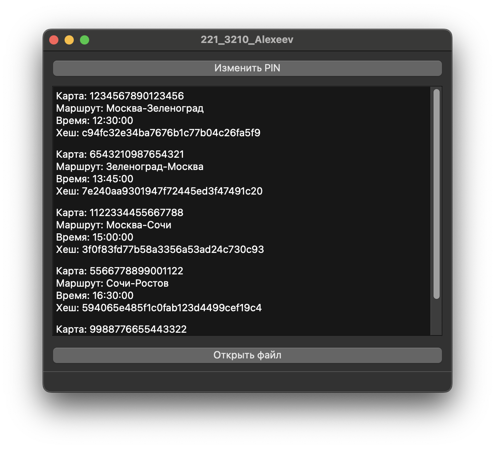

# Программа для работы с транзакциями

## Описание программы

Эта программа загружает данные о транзакциях из CSV-файла и проверяет их на наличие ошибок. В файле транзакций содержатся данные о номере карты, маршруте, времени и хеше. Программа сравнивает хеши, чтобы убедиться, что данные не были изменены, и если хеш не совпадает, она выделяет строку красным цветом. Также есть возможность сменить пин-код через приложение.

## Как работает программа

1. Программа загружает файл с транзакциями.
2. Проверяет каждый хеш транзакции.
3. Если хеш неправильный, строка будет выделена красным.
4. Программа позволяет сменить пин-код.

## Снимки интерфейса

### Главный экран с транзакциями

### Окно для смены пин-кода

## Установка и запуск

1. Установите Qt.
2. Откройте проект в Qt Creator.
3. Запустите программу.
4. В программе загрузится файл `transactions.csv` с транзакциями.
